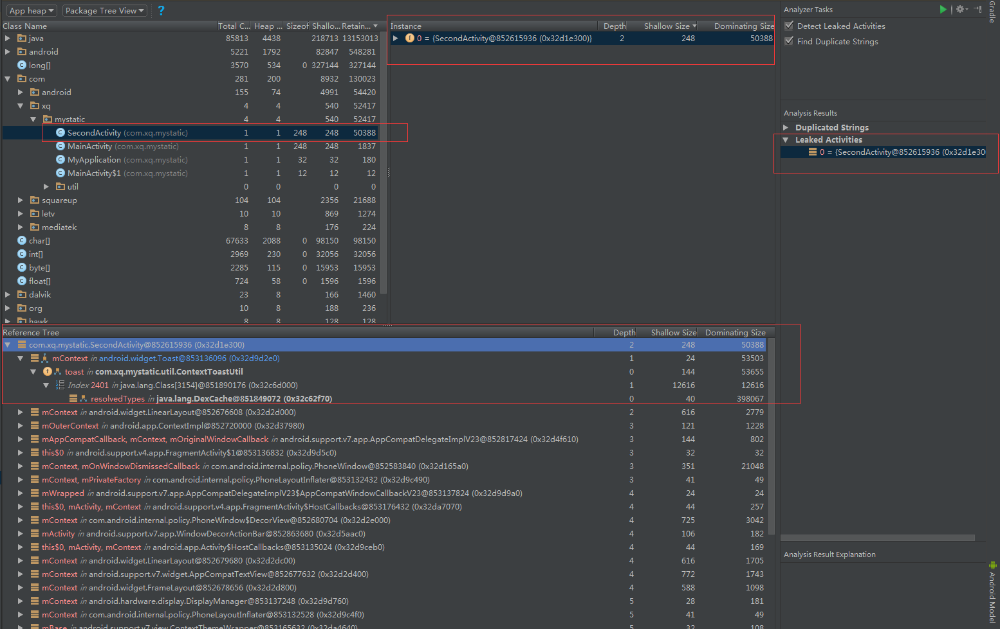
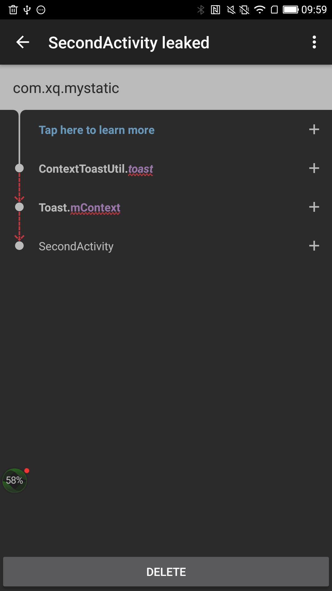

# 内存泄漏示例一：

```
public class ContextToastUtil {

    private static Toast toast;

    public static void showToast(Context context, String content) {
        if (toast == null) {
            toast = Toast.makeText(context, content, Toast.LENGTH_SHORT);
            toast.setGravity(Gravity.CENTER, 0, 0);
        } else {
            toast.setText(content);
        }

        toast.show();
    }
}
```


android monitor - memory检测：




leak canary 检测：




